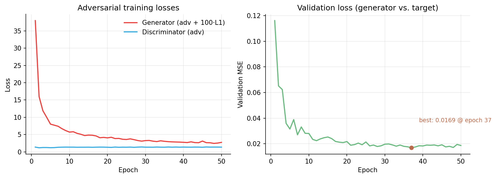

# 🎨 Attribute-Conditioned Sketch Colorization

### A Conditional pix2pix GAN for Character Colorization with Hair & Shirt Attribute Control

[](https://python.org)
[](https://pytorch.org)
[](https://jupyter.org)
[](https://opensource.org/licenses/MIT)


*Given a black-and-white character sketch plus a target hair color and shirt color, a conditional GAN learns to produce the fully colored character. This repository contains the paired dataset, the preparation pipeline, and the full pix2pix-style training implementation.*

---


---

## 📋 Table of Contents

- [Overview](#-overview)
- [Dataset](#-dataset)
- [Color Palette](#-color-palette)
- [Model Architecture](#-model-architecture)
- [Training Setup](#-training-setup)
- [Results](#-results)
- [Getting Started](#-getting-started)
- [Regenerating the Dataset](#-regenerating-the-dataset)
- [Training the Model](#️-training-the-model)
- [Project Structure](#-project-structure)
- [Future Work](#-future-work)
- [References](#-references)
- [Citation](#-citation)
- [Author](#-author)

---

## 🔬 Overview

**Attribute-conditioned sketch colorization** is the task of coloring a black-and-white character sketch according to specified categorical attributes — here, a target **hair color** and **shirt color**.

This repository implements the task end-to-end with a **conditional pix2pix GAN**: a U-Net generator and a PatchGAN discriminator, both conditioned on a one-hot attribute vector concatenated to the input as extra channels. The model is trained adversarially with an L1 reconstruction term, following the original pix2pix recipe (Isola et al., 2017), adapted here to accept categorical attribute conditioning rather than only the source image.

Built as Project 5 ("Image to Image Translation") for the Deep Catalyst course at Hoswam AI Academy.

---

## 📦 Dataset

| Split | Sketches (inputs) | Colored images (targets) | Resolution | Format    |
| ----- | ------------------ | ------------------------- | ---------- | --------- |
| Train | 10                  | 250                        | 512 × 512  | BMP (RGB) |
| Test  | 4                   | 100                        | 512 × 512  | BMP (RGB) |

Each sketch is colored in all **25 combinations** of 5 hair colors × 5 shirt colors, so every input maps to 25 targets. The pairing and attribute labels live in `metadata.csv` (one per split):

| Column   | Meaning                              | Example    |
| -------- | ------------------------------------- | ---------- |
| `input`  | Sketch filename in `inputs/`          | `0001.bmp` |
| `target` | Colored image filename in `targets/`  | `0003.bmp` |
| `hair`   | Hair color of the target              | `blue`     |
| `shirt`  | Shirt color of the target             | `red`      |

---

## 🎨 Color Palette

**Variable colors** (hair and shirt):

| Color  | Hex       |
| ------ | --------- |
| Blue   | `#3FAEE1` |
| Brown  | `#BA6B4B` |
| Red    | `#E84744` |
| Yellow | `#FBD04F` |
| Green  | `#6FBB84` |

**Fixed colors** across all images: skin `#FBD3C2`, cheeks `#F39E9C`, line art `#000000`.

The full palette is in [`raw/palette.txt`](raw/palette.txt).

---

## 🧠 Model Architecture

The attribute condition (5-way one-hot hair color ⧺ 5-way one-hot shirt color = a 10-d vector) is spatially broadcast to the input's height and width, then concatenated channel-wise to the image before every convolution stack that needs it.

### Generator — conditional U-Net (8 down / 7 up, skip connections)

| Block         | In → Out channels | Output size | Norm | Notes                          |
| ------------- | ------------------ | ----------- | ---- | ------------------------------- |
| Input         | 3 + 10 cond → 13    | 256 × 256   | —    | Sketch concatenated with condition |
| Encoder 1–8   | 13→64→128→256→512→512→512→512→512 | 128×128 → 1×1 | BatchNorm (except block 1) | Stride-2, 4×4 conv, LeakyReLU(0.2) |
| Decoder 1–3   | 512→512, 1024→512, 1024→512 | 2×2 → 8×8 | BatchNorm + Dropout(0.5) | Stride-2, 4×4 transposed conv, ReLU, skip-concat |
| Decoder 4–7   | 1024→512, 1024→256, 512→128, 256→64 | 16×16 → 128×128 | BatchNorm | Same as above, no dropout |
| Output        | 128 → 3             | 256 × 256   | Tanh | Final 4×4 transposed conv       |

**54.43M trainable parameters** (computed from the layer definitions).

### Discriminator — 70×70 PatchGAN

| Layer      | In → Out channels | Output size | Norm |
| ---------- | ------------------ | ----------- | ---- |
| Input      | 3 + 3 + 10 cond → 16 | 256 × 256 | —    |
| Layer 1    | 16 → 64             | 128 × 128   | —    |
| Layer 2    | 64 → 128            | 64 × 64     | BatchNorm |
| Layer 3    | 128 → 256           | 32 × 32     | BatchNorm |
| Layer 4    | 256 → 512           | 31 × 31     | BatchNorm |
| Output     | 512 → 1             | 30 × 30 (patch map) | — |

Classifies overlapping 70×70 patches as real or fake rather than the whole image, which pix2pix uses to encourage sharp, locally realistic textures. **2.78M trainable parameters.**

---

## 🧪 Training Setup

**Losses** (standard pix2pix objective):

| Term                | Formula                                                        |
| -------------------- | --------------------------------------------------------------- |
| Generator loss        | `BCE(D(x, G(x,c), c), 1) + λ · L1(G(x,c), y)`, λ = 100          |
| Discriminator loss    | `BCE(D(x, y, c), 1) + BCE(D(x, G(x,c), c), 0)`                  |

**Hyperparameters**

| Setting        | Value                        |
| --------------- | ----------------------------- |
| Optimizer        | Adam (β₁ = 0.5, β₂ = 0.999)   |
| Learning rate    | 2 × 10⁻⁴ (generator & discriminator) |
| Batch size       | 10                            |
| Image size       | 256 × 256                     |
| Epochs           | 50                             |
| Seed             | 8                              |
| Framework        | PyTorch 2.2.0, torchvision 0.17.0 |

---

## 📊 Results



| Metric                                    | Value              |
| ------------------------------------------- | ------------------- |
| Best validation MSE (generator vs. target)  | **0.01685** (epoch 37) |
| Final validation MSE (epoch 50)             | 0.01863              |
| Generator loss, epoch 1 → 50                | 38.0 → 2.73          |
| Discriminator loss (steady-state)           | ≈ 1.3–1.4            |

The discriminator loss settles close to `2·ln(2) ≈ 1.386` — the value it takes when it can no longer distinguish real from generated patches — which is a good sign of balanced adversarial training rather than one network overpowering the other.

No perceptual image-quality metric (SSIM/LPIPS/FID) was computed in this run; validation is currently reconstruction MSE only. See [Future Work](#-future-work).

---

## 🚀 Getting Started

### Prerequisites

```bash
pip install -r requirements.txt
```

### Setup

```bash
# 1. Clone the repository
git clone https://github.com/FarhadBayrami/GAN-Image-Colorization.git
cd GAN-Image-Colorization

# 2. Install dependencies
pip install -r requirements.txt
```

---

## 🔄 Regenerating the Dataset

The `processed/` folder (~275 MB of uncompressed BMPs) is **not committed** — it is fully reproducible from `raw/` in a few seconds, keeping the repository small and fast to clone.

```bash
mkdir -p processed/train/inputs processed/train/targets processed/test/inputs processed/test/targets
jupyter notebook dataset-preparation.ipynb
```

Run the notebook twice: once with `phase = 'train'` and once with `phase = 'test'` (first cell). For each phase the pipeline:

1. Composites every RGBA source PNG onto a white background (alpha blending) and saves it as sequentially numbered BMP (`0001.bmp`, `0002.bmp`, …)
2. Flattens the per-sketch target folders into a single numbered `targets/` directory
3. Generates `metadata.csv` linking each target to its input sketch and its hair/shirt color attributes

---

## ▶️ Training the Model

```bash
mkdir -p results weights
jupyter notebook pix2pix-training.ipynb
```

Run all cells in order. The notebook trains the generator and discriminator jointly for 50 epochs, saving:

- A generated validation sample grid to `results/img-{epoch}.png` after every epoch
- The best generator checkpoint (by validation loss) to `weights/generator-best.pt`
- The final-epoch generator to `weights/generator-last.pt`

Set `wandb_enable = True` in the arguments cell to additionally log runs to Weights & Biases.

---

## 📁 Project Structure

| Path                          | Description                                                |
| ------------------------------ | ------------------------------------------------------------ |
| `pix2pix-training.ipynb`       | Conditional pix2pix GAN: model, losses, training loop, results |
| `dataset-preparation.ipynb`    | Pipeline: raw PNGs → processed BMPs + metadata.csv          |
| `raw/palette.txt`               | Full color palette definition                                |
| `raw/train/inputs/`             | 10 source sketches (RGBA PNG)                                |
| `raw/train/targets/`            | One folder per sketch, 25 colored PNGs each                  |
| `raw/test/`                     | Same layout, 4 sketches                                       |
| `processed/`                    | Generated dataset (git-ignored, reproducible from `raw/`)     |
| `results/`                      | Per-epoch validation sample grids (git-ignored, created during training) |
| `weights/`                      | Saved generator checkpoints (git-ignored, created during training) |
| `assets/`                       | README images                                                 |
| `requirements.txt`              | Python dependencies                                           |
| `LICENSE`                       | MIT License                                                   |
| `CITATION.cff`                  | How to cite this work                                         |
| `README.md`                     | Project documentation                                         |

---

## 🔮 Future Work

- [ ] Compute perceptual image-quality metrics (SSIM, LPIPS, FID) on the test split
- [ ] Package the best generator checkpoint and add a small standalone inference script
- [ ] Extend attribute conditioning to additional categories (eye color, accessories)
- [ ] Train past 50 epochs with a learning-rate schedule — validation loss had not fully plateaued
- [ ] Log experiments to Weights & Biases (already wired via `wandb_enable`, off by default)

---

## 📖 References

- Isola, P., Zhu, J.-Y., Zhou, T., & Efros, A. A. (2017). *Image-to-Image Translation with Conditional Adversarial Networks*. CVPR. [[paper]](https://arxiv.org/abs/1611.07004)

---

## 📚 Citation

If you use this project in your work, please cite:

| Field      | Value                                                            |
| ---------- | ------------------------------------------------------------------ |
| **Author** | Farhad Bayrami                                                     |
| **Title**  | Attribute-Conditioned Sketch Colorization with a Conditional pix2pix GAN |
| **Year**   | 2025                                                                |
| **URL**    | github.com/FarhadBayrami/GAN-Image-Colorization                   |

---

## 👤 Author

**Farhad Bayrami**
Machine Learning Engineer · MSc in Artificial Intelligence
📧 <farhad.bayrami@studio.unibo.it> 🔗 [GitHub](https://github.com/FarhadBayrami)
