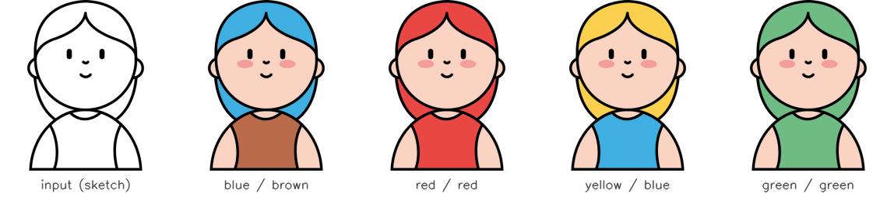

# Sketch Colorization

**Attribute-conditioned sketch colorization**: given a black-and-white character sketch plus a target *hair color* and *shirt color*, a model learns to produce the fully colored character. This repository contains the paired dataset and its preparation pipeline.



Built as a project for the Deep Catalyst course at Hoswam.

## Dataset overview

| Split | Sketches (inputs) | Colored images (targets) | Resolution | Format |
|-------|------------------:|-------------------------:|------------|--------|
| Train | 10                | 250                      | 512 × 512  | BMP (RGB) |
| Test  | 4                 | 100                      | 512 × 512  | BMP (RGB) |

Each sketch is colored in all **25 combinations** of 5 hair colors × 5 shirt colors, so every input maps to 25 targets. The pairing and attribute labels live in `metadata.csv` (one per split):

| Column   | Meaning                                   | Example    |
|----------|-------------------------------------------|------------|
| `input`  | Sketch filename in `inputs/`              | `0001.bmp` |
| `target` | Colored image filename in `targets/`      | `0003.bmp` |
| `hair`   | Hair color of the target                  | `blue`     |
| `shirt`  | Shirt color of the target                 | `red`      |

## Color palette

Variable colors (hair and shirt): **blue** `#3FAEE1`, **brown** `#BA6B4B`, **red** `#E84744`, **yellow** `#FBD04F`, **green** `#6FBB84`.

Fixed colors across all images: skin `#FBD3C2`, cheeks `#F39E9C`, line art `#000000`. The full palette is in [`raw/palette.txt`](raw/palette.txt).

## Repository structure

```
sketch-colorization/
├── dataset-preparation.ipynb   # Pipeline: raw PNGs → processed BMPs + metadata.csv
├── raw/                        # Source artwork (committed)
│   ├── palette.txt
│   ├── train/
│   │   ├── inputs/             # 10 sketches (RGBA PNG)
│   │   └── targets/            # One folder per sketch, 25 colored PNGs each
│   └── test/                   # Same layout, 4 sketches
├── processed/                  # Generated dataset (git-ignored — see below)
│   ├── train/
│   │   ├── inputs/   targets/   metadata.csv
│   └── test/
│       ├── inputs/   targets/   metadata.csv
├── assets/                     # README images
└── requirements.txt
```

The `processed/` folder (~275 MB of uncompressed BMPs) is **not committed** — it is fully reproducible from `raw/` in a few seconds, which keeps the repository small and fast to clone.

## Regenerating the processed dataset

```bash
pip install -r requirements.txt
mkdir -p processed/train/inputs processed/train/targets processed/test/inputs processed/test/targets
jupyter notebook dataset-preparation.ipynb
```

Run the notebook twice: once with `phase = 'train'` and once with `phase = 'test'` (first cell). For each phase the pipeline:

1. Composites every RGBA source PNG onto a white background (alpha blending) and saves it as sequentially numbered BMP (`0001.bmp`, `0002.bmp`, …).
2. Flattens the per-sketch target folders into a single numbered `targets/` directory.
3. Generates `metadata.csv` linking each target to its input sketch and its hair/shirt color attributes.

## Intended use

The dataset is designed for conditional image-to-image translation experiments (e.g., pix2pix-style GANs or conditional diffusion), where the condition is the sketch plus a categorical attribute pair. The small size and fixed palette make it a fast, controlled benchmark for studying attribute conditioning.

## License

Released under the [MIT License](LICENSE).
